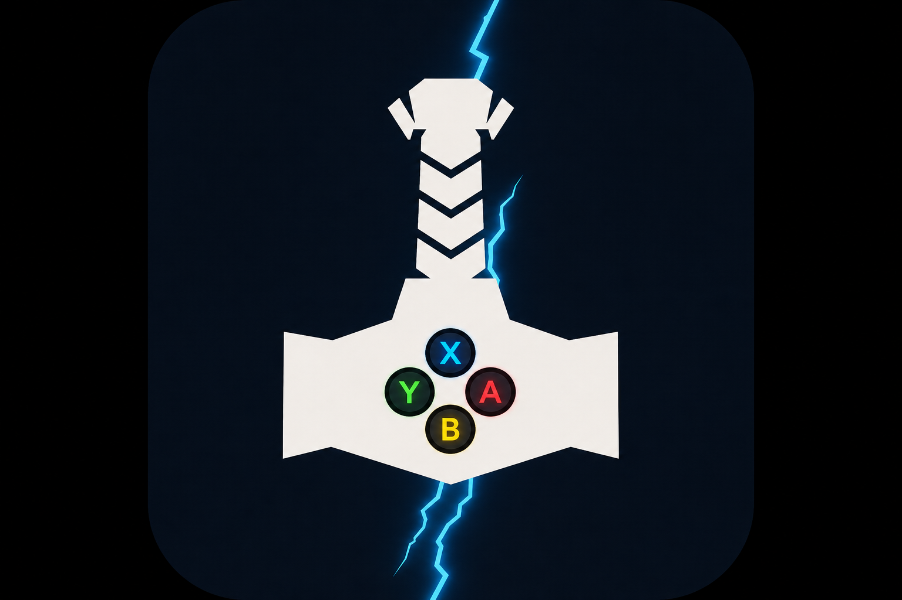
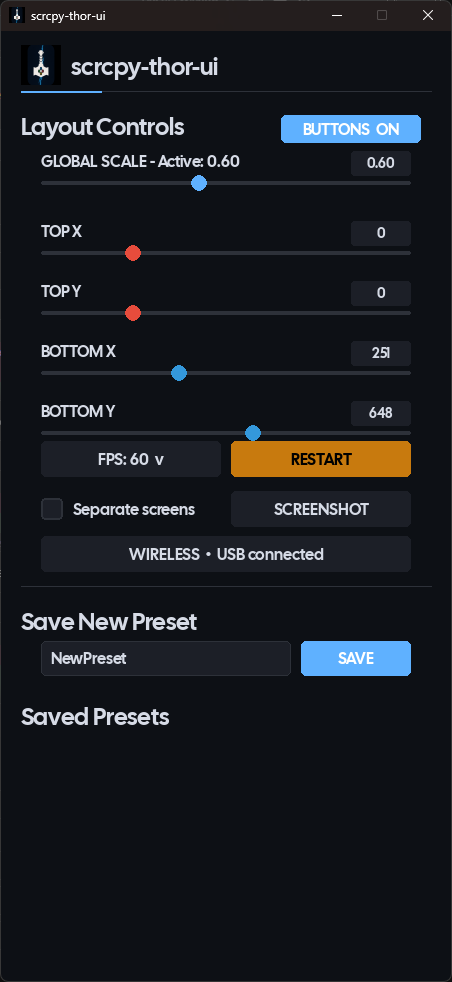
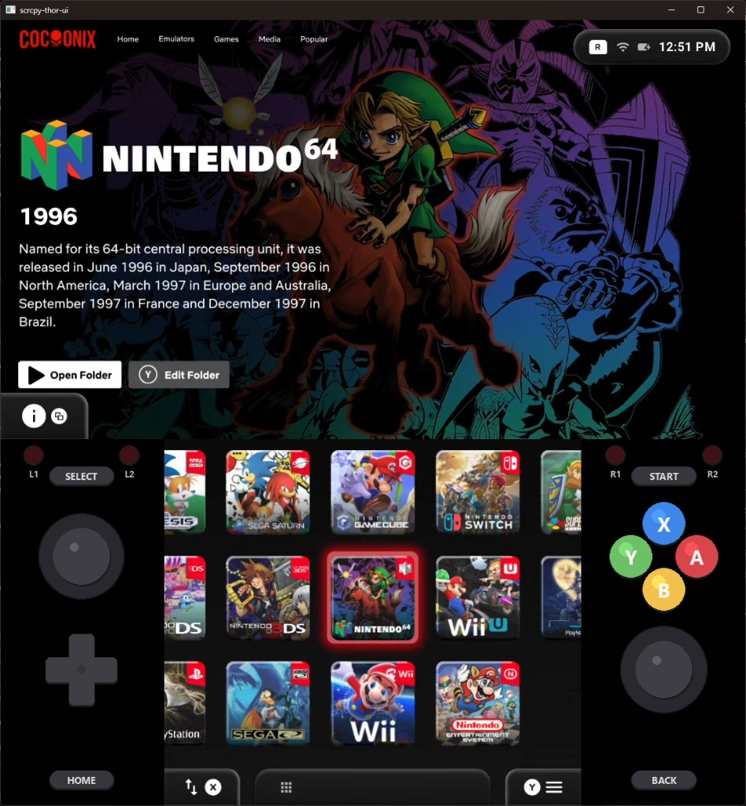

<p align="center">
  
</p>

<h1 align="center">scrcpy-thor-ui</h1>

<p align="center">
  <em>A dual-screen scrcpy launcher for the AYN Thor with a live virtual controller overlay.</em>
</p>

<p align="center">
  <a href="https://github.com/tommywaaf/scrcpy-thor-ui/releases/latest">
    
  </a>
  <a href="LICENSE">
    
  </a>
  
</p>

> **Quick start (no Python needed):** grab `scrcpy-thor-ui.exe` from the
> [latest release](https://github.com/tommywaaf/scrcpy-thor-ui/releases/latest),
> drop it next to the bundled `bin/`, `config/` and `logs/` folders
> from this repo, and double-click it.

scrcpy-thor-ui mirrors both screens of the AYN Thor to your Windows
desktop and draws a real-time virtual controller around the bottom
screen. Every button press, joystick tilt, D-pad direction and trigger
pull on the actual handheld is reflected on screen in the same instant
— so what you see on the desktop genuinely looks like an AYN Thor.

It's tuned for low latency, runs at H.265 with `low-latency=1` on the
device's MediaCodec encoder, gives you on-the-fly FPS switching
(30 / 60 / 120) and a one-click restart for global-scale or FPS changes
to take effect.

| Menu UI                             | Mirror UI                              |
|-------------------------------------|----------------------------------------|
|  |   |

> **Designed for Windows 11.** Windows 10 (1809+) should work but bugs may occur.

---

## Highlights

### Live virtual controller overlay
- Procedurally drawn AYN Thor button layout in the empty space on each side of the bottom screen — no screen real estate is wasted.
- Left strip (top → bottom): **L1 / L2 LEDs**, **SELECT**, **left joystick**, **D-pad**, **HOME**.
- Right strip (top → bottom): **R1 / R2 LEDs**, **START**, **X / Y / B / A** cluster, **right joystick**, **BACK**.
- Face buttons follow the AYN Thor silkscreen exactly: **X top, A right, B bottom, Y left**.
- L1 / L2 / R1 / R2 indicators glow from dim red to bright red when their triggers fire.
- Joystick caps offset smoothly within their wells based on real stick position (Hall-effect axes are handled with a deadzone for clean rest behaviour).
- D-pad arms light up independently. Pills (`SELECT` / `START` / `HOME` / `BACK`) and ABXY circles darken when pressed.
- One-click **`BUTTONS ON / OFF`** toggle in the control panel hides or shows the entire overlay; preference persists in `config/config.json`.

### Real-time input streaming from the device
- Pulls events directly from the Thor's `Odin Controller` input node via `adb shell getevent -lq`, so there's no Android-side companion app to install.
- Auto-detects the gamepad device path on startup (probes `getevent -p` and prefers `Odin Controller`, with a sensible fallback).
- Parses the Linux event stream into a thread-safe button-state dict and throttles redraws to ~30 fps so an axis-storm never melts the renderer.

### Performance tuning over upstream scrcpy launches
- Switches the codec to **H.265** with the MediaCodec **`low-latency=1`** option for sharply lower encode latency.
- Uses the **`direct3d`** SDL render driver on Windows (lower latency than the previous `opengl`).
- Caps at **60 fps** by default (with **30 / 60 / 120** selectable from the control panel).
- Adds **`HIGH_PRIORITY_CLASS`** to both scrcpy children so the OS doesn't deschedule the encoder under load.
- Fixes a serious **`subprocess.PIPE` deadlock** that intermittently stalled video and audio when scrcpy's stdout/stderr pipe filled up. (Now routed to `DEVNULL`.)
- Tunes audio buffers to **`--audio-buffer=30 --audio-output-buffer=5`** for tight A/V sync.
- Enables `--video-buffer=0`, `--no-mipmaps`, `--no-power-on`, `--no-cleanup` for a snappier startup and minimal jitter.
- Reduces the bitrate scale factor (now ~50% of the previous default) to better match H.265's efficiency and avoid USB saturation when running two streams at once.

### Window-sync optimisations
- Geometry cache: `SetWindowPos` is only invoked when the embedded scrcpy windows actually need to move, instead of being hit twice per frame at 60 Hz.
- Removed `SWP_NOCOPYBITS` from the dock sync, so the embedded scrcpy frames aren't trashed by needless full repaints.
- Hardened ctypes signatures for GDI calls (`SelectObject`, `BitBlt`, `CreateCompatibleDC`, `DeleteObject`, `DeleteDC`) so 64-bit Windows handles never get truncated.

### Control panel additions
- **FPS selector** (cycles 30 → 60 → 120) saved to `config.json`.
- **RESTART** button that re-launches the app cleanly so global-scale or FPS changes take effect without you needing to touch a terminal.
- **`BUTTONS ON / OFF`** chassis toggle.
- All while preserving the upstream layout sliders, undock / dock, screenshot, wireless connection dialog and preset save/load/delete.

### Inherited features
- Native Win32 container that hosts both scrcpy windows as embedded children.
- Layout sliders for Top X / Y and Bottom X / Y.
- Layout presets stored in `config/layout.json` (save / load / delete from the UI).
- One-click clipboard screenshot of the entire docked container, including transparency where the screens aren't.
- Wireless ADB connection dialog (Android 11+ pair-with-code or legacy `IP:5555`).
- Comprehensive logging with daily rotation in `logs/`.
- Full PyInstaller bundling support via `build.py`.

---

## Installation

> **Requirement:** USB Debugging must be enabled on your Thor.
>
> 1. **Settings → About device.**
> 2. Tap **Build number** seven times.
> 3. **Settings → Developer options → USB debugging.**
>
> Then connect via USB or use the in-app **Wireless** dialog to pair.

### Option 1 — Run from source

> Pygame doesn't ship a wheel for Python 3.14 yet; use Python 3.10–3.12.

```powershell
git clone https://github.com/tommywaaf/scrcpy-thor-ui.git
cd scrcpy-thor-ui
pip install -r requirements.txt
python main.py
```

### Option 2 — Build a standalone executable

```powershell
pip install pyinstaller
python build.py
```

Output appears at `dist/scrcpy-thor-ui.exe`. Place the executable in
a folder that also contains `bin/`, `config/` and `logs/`.

### Option 3 — Pre-built release

Pre-built executables (when available) live on the
[Releases](https://github.com/tommywaaf/scrcpy-thor-ui/releases) page.

---

## Bundled software

scrcpy-thor-ui ships with the following third-party binaries for
end-user convenience. They are unmodified.

- **scrcpy v3.3.4** — Apache License 2.0. See `bin/LICENSE_scrcpy.txt`. Source: https://github.com/Genymobile/scrcpy
- **ADB (Android Debug Bridge)** — Apache License 2.0.
- **Cal Sans** font — SIL Open Font License 1.1. See `assets/fonts/OFL.txt`.

To rebuild `bin/` from scratch, extract the
[latest scrcpy release](https://github.com/Genymobile/scrcpy/releases/tag/v3.3.4)
into the `bin/` folder.

---

## Requirements

| | |
|-|-|
| **OS** | Windows 11 (Windows 10 1809+ likely works) |
| **Python** | 3.8+ when running from source (3.10–3.12 recommended) |
| **Device** | AYN Thor with USB Debugging enabled |
| **Cable** | Data-capable USB cable; USB 3 port strongly recommended |

---

## Usage

### Connecting the device
- **USB:** Plug in the Thor and launch scrcpy-thor-ui. The first launch will require you to tap **Allow** on the device when the RSA-key prompt appears.
- **Wireless:** Launch without a USB device, click **Wireless** in the control panel, then either:
  - Pair with code (Android 11+ Wireless Debugging), or
  - Connect by `IP:5555` after enabling TCP/IP mode while still wired.

### Control panel walkthrough

| Element | What it does |
|---|---|
| `BUTTONS  ON / OFF` | Show or hide the chassis overlay (top-right of the layout area). |
| **GLOBAL SCALE** | Sets the scrcpy capture scale (0.3 — 1.0). Requires a **RESTART** to apply. |
| **TOP X / Y** | Position of the top scrcpy window inside the container. |
| **BOTTOM X / Y** | Position of the bottom scrcpy window inside the container. |
| **FPS: 30 / 60 / 120** | Cycles the scrcpy `--max-fps` cap. Requires a **RESTART** to apply. |
| **RESTART** | Cleanly relaunches the app. Use after changing **GLOBAL SCALE** or **FPS**. |
| **UNDOCK / DOCK** | Floats the two scrcpy windows free of the container (handy for individual capture in OBS), or pulls them back together. |
| **SCREENSHOT** | Copies a transparent dual-screen capture of the docked container to the clipboard. (Docked only.) |
| **WIRELESS** | Opens the wireless pairing dialog. |
| **Save / Load / Del Preset** | Layout presets stored in `config/layout.json`. |

---

## Configuration

### `config/config.json`

```json
{
  "global_scale": 0.6,
  "tx": 0,
  "ty": 0,
  "bx": 251,
  "by": 648,
  "max_fps": 60,
  "chassis_enabled": true
}
```

### `config/layout.json`

```json
{
  "Default": {
    "tx": 0,
    "ty": 0,
    "bx": 251,
    "by": 648,
    "global_scale": 0.6
  },
  "Streaming": {
    "tx": 100,
    "ty": 50,
    "bx": 300,
    "by": 700,
    "global_scale": 0.3
  }
}
```

### Logs
Daily-rotated logs land in `logs/`:
- `thorcpy_YYYYMMDD.log` — main application log.
- `thorcpy_top_YYYYMMDD_HHMMSS.log` / `thorcpy_bottom_YYYYMMDD_HHMMSS.log` — scrcpy stream logs.

Bump the level in `main.py`:

```python
logging.basicConfig(level=logging.DEBUG, ...)
```

---

## Troubleshooting

### Device not detected
- Confirm USB Debugging is on, tap **Allow** when the RSA prompt appears.
- Try a different (data-capable) cable; charge-only cables won't show as a device.
- `bin\adb.exe devices` should list `e17da8dd  device`. If it shows `unauthorized`, accept the prompt on the Thor.
- Restart the daemon: `bin\adb.exe kill-server` then `bin\adb.exe start-server`.

### Audio or video stutters intermittently
- Use a **USB 3** (blue) port. Two simultaneous H.265 streams can saturate USB 2.
- Lower **GLOBAL SCALE** (e.g. 0.5) and **RESTART**.
- Drop **FPS** to 30 for older or low-fps games.
- Make sure no other heavy CPU task is running on the host. (scrcpy already runs at high priority but doesn't preempt all OS work.)

### Button overlay doesn't react
- Confirm USB Debugging is enabled — the live input listener depends on `adb shell getevent`.
- The chassis listens to `/dev/input/event9` (`Odin Controller`); other devices on the Thor's input bus shouldn't be picked up automatically. If it ever is, file an issue with `adb shell getevent -p` output attached.

### Windows won't dock or container looks blank
- Wait a few seconds after launch; the docking monitor needs a tick to find each scrcpy window by title.
- Toggle **DOCK / UNDOCK** once.
- Restart the application.

### Scrcpy won't start
- Confirm `bin\scrcpy.exe` is present.
- Check the latest log for errors.
- Try running scrcpy manually: `bin\scrcpy.exe -s YOUR_DEVICE_SERIAL`.

### Missing DLLs / import errors
- `pip install -r requirements.txt --force-reinstall`.
- Install the latest **Visual C++ Redistributables**.

---

## Credits & upstream

scrcpy-thor-ui is built on top of the excellent
[**ThorCPY**](https://github.com/theswest/ThorCPY) by *the_swest*,
which provided the original dual-screen Win32 docking, layout editor,
preset system, screenshot pipeline and wireless pairing flow. All of
that is preserved here under GPL v3 — please support upstream.

This fork additionally credits:

- **[scrcpy](https://github.com/Genymobile/scrcpy)** by Romain Vimont — the screen-mirroring engine that makes any of this possible.
- **[Cal Sans](https://github.com/calcom/font)** by Cal.com Inc. — UI typography (SIL OFL 1.1).
- **[Pygame](https://www.pygame.org/)** — UI rendering, font drawing, off-screen surfaces for the chassis.
- **[eldermonkey](https://github.com/eldermonkey)** — the original ThorCPY logo.
- The AYN Thor community — for documenting the Odin Controller input map.

---

## License

scrcpy-thor-ui is licensed under the **GNU General Public License
v3.0** (inherited from upstream ThorCPY). See `LICENSE` for the full
text. You're free to modify and redistribute under the same terms.

scrcpy is licensed under Apache 2.0 — see `bin/LICENSE_scrcpy.txt`.
Cal Sans is licensed under SIL OFL 1.1 — see `assets/fonts/OFL.txt`.
